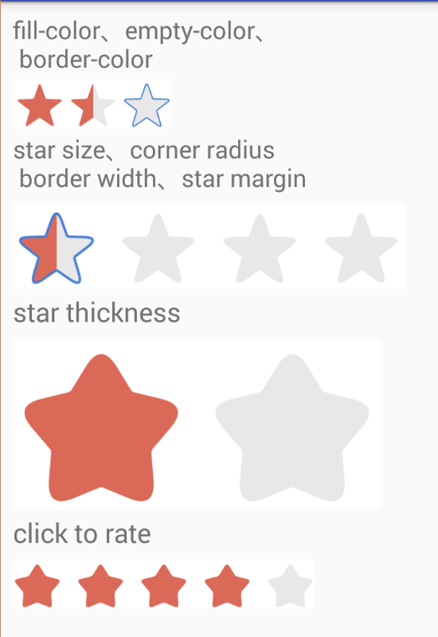

# AndroidRatingStar
RatingStar is specific RatingBar use star drawable as the rating mark.

# Features
The following screenshot shows the features RatingStar provides:



# Usage
## gradle dependencies
See "https://jitpack.io/#everhad/AndroidRatingStar/v1.0.3".

### Step 1. Add the JitPack repository to your build file
```code
allprojects {
    repositories {
        ...
        maven { url 'https://jitpack.io' }
    }
}
```

### Step 2. Add the dependency
```code
dependencies {
    compile 'com.github.everhad:AndroidRatingStar:v1.0.3'
}
```

## In Your 'layout.xml'
```xml
<com.idlestar.ratingstar.RatingStarView
     app:rsv_cornerRadius="4dp"
     app:rsv_starMargin="12dp"
     app:rsv_strokeWidth="2px"
     app:rsv_strokeColor="#457DD7"
     app:rsv_starForegroundColor="#DB6958"
     app:rsv_starBackgroundColor="#E8E8E8"
     app:rsv_starNum="5"
     app:rsv_rating="1"
     app:rsv_onlyHalfStar="true"
     app:rsv_enableSelectRating="true"
     app:rsv_starThickness="0.7"
     android:layout_marginTop="8dp"
     app:rsv_drawStrokeForEmptyStar="false"
     app:rsv_drawStrokeForHalfStar="true"
     android:paddingTop="2dp"
     android:paddingLeft="0dp"
     android:paddingRight="0dp"
     android:background="#fff"
     android:layout_width="wrap_content"
     android:layout_height="40dp" />
```

## In Your Code
```code
@Override
protected void onCreate(Bundle savedInstanceState) {
  super.onCreate(savedInstanceState);
  setContentView(R.layout.activity_main);

  RatingStarView rsv_rating = (RatingStarView) findViewById(R.id.rsv_rating);
  rsv_rating.setRating(1.5f);
}
```
